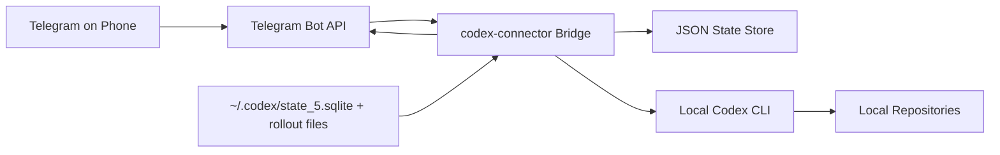

# codex-connector

<p align="center">
  <strong>Drive local Codex sessions from Telegram.</strong><br />
  Local-first mobile control, project switching, session mirroring, and phone-friendly results.
</p>

<p align="center">
  
  
  
</p>

`codex-connector` is a small bridge that lets you keep using your local `codex` CLI from your phone. It does not move your repos or secrets into the cloud. Telegram is the control surface; execution still happens on your machine.

> Use Telegram as a thin remote control for the Codex setup you already trust on your laptop.
>
> Scope is intentionally narrow: this repo is Telegram-first, local-first, and single-user oriented. The built-in runner is `codex`. If you want Slack, Discord, Matrix, Signal, or another agent CLI, fork it or send a focused PR rather than expanding the core into a framework.

## Why

Codex is excellent at the desk, but awkward the moment you walk away from your laptop. This project adds a thin Telegram layer on top of the local workflow you already have:

- Continue the latest Codex session by sending plain text from your phone.
- Start a new task in a specific repo without opening a terminal.
- See compact progress updates while Codex is running locally.
- Mirror desktop Codex sessions back into Telegram.
- Keep project context aligned with the latest active session.

## Design Goals

- Keep execution local. Repos, secrets, and toolchains stay on your machine.
- Optimize for phone use. Updates should be short, readable, and actionable.
- Stay small. This is a thin control plane over local Codex, not a new agent platform.
- Prefer opinionated defaults over transport abstraction and plugin sprawl.

## Core Idea

There are only two moving parts in the core:

- `Telegram transport`: receive commands, send short updates, render buttons.
- `Runner`: turn `new` or `continue` into a local CLI invocation inside a repo.

Today the built-in runner is `codex`. The runner boundary is intentionally small so a fork or focused PR can swap in another local CLI without rewriting the Telegram flow.

## Positioning

This repo is deliberately narrower than tools like [OpenClaw](https://github.com/openclaw/openclaw) or [nanochat](https://github.com/karpathy/nanochat):

| Project | Primary job |
| --- | --- |
| `codex-connector` | Remote-control a local agent CLI from Telegram |
| `OpenClaw` | General personal AI assistant across many chat apps, tools, nodes, and skills |
| `nanochat` | Minimal experimental harness for training, finetuning, evaluating, and chatting with your own LLM |

In other words:

- If you want a thin Telegram bridge for your existing local coding workflow, this repo is the right shape.
- If you want an always-on multi-channel assistant with broader tooling and automation, OpenClaw is closer.
- If you want to train or serve your own model stack, nanochat is solving a different problem entirely.

## Not Trying To Be

- a multi-user chatbot service
- a hosted relay or remote execution layer
- a cross-platform messaging abstraction for every chat app
- a replacement for the Codex desktop app or CLI

## How It Works

| Capability | What you get |
| --- | --- |
| Remote control | Start a new task, continue a session, or check status from Telegram |
| Project switching | `/project` shows recent sessions and inline buttons for quick switching |
| New-task picker | `/new` without a prompt opens a project picker and arms the next plain-text message as a fresh session |
| Session continuity | Plain text defaults to continuing the latest active project context |
| Desktop mirroring | Local Codex sessions can push `started`, `update`, and `completed` events into Telegram |
| Mobile-friendly output | Intermediate updates are short; long completions are split into multiple Telegram messages |
| Local-first runtime | Repos, tools, and Codex execution stay on your machine |

## Architecture



## Quick Start

1. Install the package from source.

   ```bash
   python3 -m pip install -e .
   ```

2. Create a Telegram bot token and learn your chat id.

   ```bash
   @BotFather -> /newbot
   https://api.telegram.org/bot<YOUR_TOKEN>/getUpdates
   ```

3. Ask your local Codex to write the config for you instead of editing JSON by hand.

   Give Codex a prompt like this:

   ```text
   In /absolute/path/to/codex-connector, create /absolute/path/to/codex-connector/config.json for codex-connector.
   Use this Telegram bot token: <YOUR_BOT_TOKEN>
   Use this Telegram chat id: <YOUR_CHAT_ID>
   Read ~/.codex/.codex-global-state.json and populate projects from my local Codex setup.
   Restrict allowed_chat_ids to my chat id.
   Enable codex_sessions.
   Keep config.json local and do not commit it.
   ```

   If you prefer manual editing, [config.example.json](config.example.json) is the reference file, but the intended flow is to let Codex write your local config.

4. Start the bridge.

   ```bash
   codex-connector serve --config ./config.json
   ```

5. Open Telegram and try:

   ```text
   /project
   /new
   summarize the latest changes
   /continue tighten the tests
   /status
   ```

## Telegram Flow

- `/project` shows the active project, recent sessions, and inline project buttons.
- `/new` opens a project picker and treats the next plain-text message as a fresh session.
- Plain text without a command continues the latest active project context.
- `/status`, `/last`, and `/help` stay available as lightweight control commands.

## Extending The Runner

If you want to use another local CLI, the intended customization point is the runner layer:

1. Add a runner implementation next to [codex_adapter.py](src/codex_connector/codex_adapter.py).
2. Register it in [runner.py](src/codex_connector/runner.py).
3. Point `config.json` at a different `runner.provider` and `runner.binary`.

The core repo only ships `codex` by default. First-party support for every agent CLI is intentionally out of scope.

Minimal template: [docs/custom-runner.md](docs/custom-runner.md)

## Realtime Session Mirroring

When `codex_sessions.enabled` is `true`, the bridge reads the local Codex `threads` table in read-only mode and mirrors activity from every local session:

- `task_started`
- `agent_message`
- `task_complete`

Behavior details:

- Existing history is skipped on startup.
- New sessions are followed from the beginning.
- Intermediate `update` messages are shortened for mobile reading.
- Completion messages are sent in full, split across multiple Telegram messages when needed.
- The latest mirrored session can automatically update the active project for that chat.
- On macOS, mirrored session notifications can switch to `silent` or `suppress` while the desktop is active.

## Development

Run tests:

```bash
PYTHONDONTWRITEBYTECODE=1 python3 -m unittest discover -s tests -v
```

Build sdist and wheel:

```bash
uv build
```

Local CLI examples:

```bash
codex-connector run --config ./config.json --project codex-connector --mode new "summarize this repo"
codex-connector status --config ./config.json --chat-id 390429375
codex-connector last --config ./config.json --chat-id 390429375
```

## Security Notes

- Restrict `allowed_chat_ids` to chats you control.
- `serve` now fails closed unless `allowed_chat_ids` is configured or `security.allow_unlisted_chats` is explicitly enabled.
- Keep `config.json` local and out of git.
- Leave `security.require_existing_repos` enabled unless you have a strong reason not to.
- Only expose repositories you trust.
- Treat this as a personal local tool, not a public multi-user service.

## Limitations

- Telegram is a compact control layer, not a rich IDE.
- Outputs are optimized for phones, not diffs or large logs.
- The bridge assumes your local `codex` CLI and project environment are already configured correctly.

## Contributing

- Keep changes small, local-first, and Telegram-first; avoid turning this into a hosted service or generic chat framework.
- Add or update `unittest` coverage for command parsing, state persistence, and Telegram callbacks when behavior changes.
- Prefer mobile-oriented UX: short intermediate updates, explicit project context, and deterministic callback flows.
- When adding config surface area, update both [config.example.json](config.example.json) and this README in the same change.
- If you want another chat transport or another runner, the preferred path is a focused fork or a narrowly scoped PR that does not complicate the default Telegram + Codex path.

## Out Of Scope

- multi-user bot hosting or tenant isolation
- remote code execution on machines you do not control
- first-party support for every chat application
- first-party support for every agent CLI
- full IDE-style chat history, diff browsing, or rich artifact rendering inside Telegram
- replacing the local Codex CLI; this project is a thin control plane, not a new agent runtime

## Repository

- Custom runner notes: [docs/custom-runner.md](docs/custom-runner.md)
- Package metadata: [pyproject.toml](pyproject.toml)
