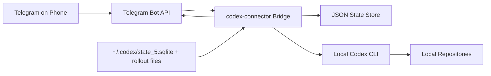

# codex-connector

<p align="center">
  <strong>Drive local Codex sessions from Telegram.</strong><br />
  Local-first mobile control, project switching, session mirroring, and phone-friendly results.
</p>

<p align="center">
  
  
  
</p>

`codex-connector` is a small bridge that lets you keep using your local `codex` CLI from your phone. It does not move your repos or secrets into the cloud. Telegram is just the control surface; execution still happens on your machine.

> Use Telegram as a thin remote control for the Codex setup you already trust on your laptop.

## Why

Codex is excellent at the desk, but awkward the moment you walk away from your laptop. This project adds a thin Telegram layer on top of the local workflow you already have:

- Continue the latest Codex session by sending plain text from your phone.
- Start a new task in a specific repo without opening a terminal.
- See compact progress updates while Codex is running locally.
- Mirror desktop Codex sessions back into Telegram.
- Keep project context aligned with the latest active session.

## Demo

Full walkthrough: [docs/demo.md](docs/demo.md)

```text
You      /project
Bot      Active project: codex-connector
         Recent sessions:
         1. codex-connector | 2026-03-19 10:18:21 | tighten Telegram callback handling
         2. CoPaw          | 2026-03-19 09:55:03 | review memory routing
         [• codex-connector] [CoPaw]
         [meta-autoresearch] [dpsgd-pe]

You      /new add a smoke test for project callback buttons
Bot      Queued new task 71d8b7... for codex-connector

Bot      [codex-connector] callback tests · update
         added Telegram callback parsing and inline button coverage

Bot      [codex-connector] callback tests · completed
         Added callback-query support, split long Telegram replies, and
         kept /project switch buttons wired to the active chat context.
```

## Best For

- People already using local Codex who want quick mobile follow-up while away from the keyboard
- Personal single-user setups where Telegram is only the transport, not the execution environment
- Workflows that benefit from lightweight session mirroring without exposing repos to a hosted agent

## What It Does

| Capability | What you get |
| --- | --- |
| Remote control | `/new`, `/continue`, `/status`, `/last`, and plain-text follow-ups from Telegram |
| Project switching | `/project` shows recent sessions and inline buttons for quick switching |
| Session continuity | Plain text defaults to continuing the latest active project context |
| Desktop mirroring | Local Codex sessions can push `started`, `update`, and `completed` events into Telegram |
| Mobile-friendly output | Intermediate updates are short; long completions are split into multiple Telegram messages |
| Local-first runtime | Repos, tools, and Codex execution stay on your machine |

## Architecture



## Quick Start

1. Install the package from source.

   ```bash
   python3 -m pip install -e .
   ```

2. Copy the example config.

   ```bash
   cp config.example.json config.json
   ```

3. Fill in your Telegram token, chat id, and local project paths.

4. Start the bridge.

   ```bash
   codex-connector serve --config ./config.json
   ```

5. Open Telegram and try:

   ```text
   /project
   /new summarize the latest changes
   /continue tighten the tests
   /status
   ```

## Configuration

Copy `config.example.json` to `config.json` and edit the values for your machine.

The config supports:

- Telegram bot credentials and an allowlist of chat ids
- A fixed list of local repositories
- Optional `codex.timeout_seconds` for long-running Codex tasks
- Optional realtime session mirroring from local Codex state
- Optional runtime settings such as `state_path`, `log_path`, and `max_output_chars`

Example:

```json
{
  "telegram": {
    "bot_token": "123456789:REPLACE_WITH_YOUR_BOT_TOKEN",
    "allowed_chat_ids": [123456789],
    "poll_interval_seconds": 2,
    "request_timeout_seconds": 30
  },
  "codex": {
    "binary": "codex",
    "timeout_seconds": 0
  },
  "codex_sessions": {
    "enabled": true,
    "state_db_path": "~/.codex/state_5.sqlite",
    "poll_interval_seconds": 2.0,
    "include_user_messages": false
  },
  "runtime": {
    "state_path": "./state.json",
    "log_path": "./codex-connector.log",
    "max_output_chars": 1200
  },
  "projects": [
    {
      "name": "codex-connector",
      "repo_path": "/Users/you/Documents/GitHub/codex-connector"
    }
  ]
}
```

## Telegram Commands

| Command | Behavior |
| --- | --- |
| `/project` | Show the active project, recent sessions, and inline project buttons |
| `/project <name>` | Switch the active project and show the same session list |
| `/new <prompt>` | Start a new Codex task in the active project |
| `/continue <prompt>` | Continue the latest Codex session in the active project |
| `/last` | Show the most recent recorded task for the active project |
| `/status` | Show the active project and whether a task is running |
| `/help` | Show the command list |

Plain text without a command is treated as `/continue`.

## Realtime Session Mirroring

When `codex_sessions.enabled` is `true`, the bridge reads the local Codex `threads` table in read-only mode and mirrors activity from every local session:

- `task_started`
- `agent_message`
- `task_complete`

Behavior details:

- Existing history is skipped on startup.
- New sessions are followed from the beginning.
- Intermediate `update` messages are shortened for mobile reading.
- Completion messages are sent in full, split across multiple Telegram messages when needed.
- The latest mirrored session can automatically update the active project for that chat.

## Development

Run tests:

```bash
PYTHONDONTWRITEBYTECODE=1 python3 -m unittest discover -s tests -v
```

Build sdist and wheel:

```bash
uv build
```

Local CLI examples:

```bash
codex-connector run --config ./config.json --project codex-connector --mode new "summarize this repo"
codex-connector status --config ./config.json --chat-id 390429375
codex-connector last --config ./config.json --chat-id 390429375
```

## Security Notes

- Restrict `allowed_chat_ids` to chats you control.
- Keep `config.json` local and out of git.
- Only expose repositories you trust.
- Treat this as a personal local tool, not a public multi-user service.

## Limitations

- Telegram is a compact control layer, not a rich IDE.
- Outputs are optimized for phones, not diffs or large logs.
- The bridge assumes your local `codex` CLI and project environment are already configured correctly.

## Repository

- Demo walkthrough: [docs/demo.md](docs/demo.md)
- Example config: [config.example.json](config.example.json)
- Package metadata: [pyproject.toml](pyproject.toml)
