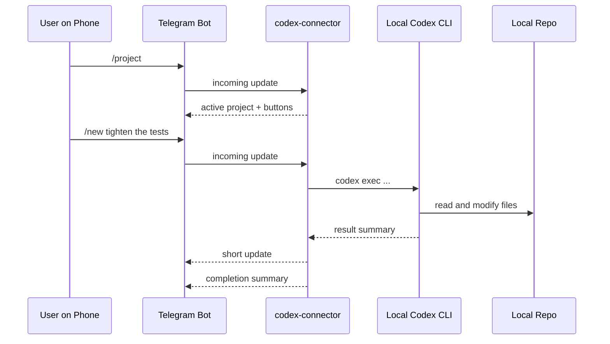

# Demo

This page is a compact, copy-pasteable walkthrough you can use for a GitHub preview, a live screen recording, or a quick handoff to another user.

## Scenario 1: Quick Project Switch From Telegram

```text
You      /project
Bot      Active project: codex-connector
         Recent sessions:
         1. codex-connector | 2026-03-19 10:18:21 | tighten Telegram callback handling
         2. CoPaw          | 2026-03-19 09:55:03 | review memory routing
         3. dpsgd-pe       | 2026-03-19 09:02:14 | inspect training logs
         [• codex-connector] [CoPaw]
         [dpsgd-pe] [meta-autoresearch]

You      tap "CoPaw"
Bot      Active project set to CoPaw
         Active project: CoPaw
         Recent sessions:
         1. codex-connector | 2026-03-19 10:18:21 | tighten Telegram callback handling
         2. CoPaw          | 2026-03-19 09:55:03 | review memory routing
         [codex-connector] [• CoPaw]
         [dpsgd-pe] [meta-autoresearch]
```

Why this matters:

- You do not need to remember exact project names every time.
- The button row acts like a lightweight mobile project picker.
- The latest mirrored session can still move the active project when that behavior is useful.

## Scenario 2: Start a Task From Your Phone

```text
You      /new add a smoke test for project callback buttons
Bot      Queued new task 71d8b7... for codex-connector

Bot      [codex-connector] callback tests · update
         added Telegram callback parsing and inline button coverage

Bot      [codex-connector] callback tests · completed
         Added callback-query support, split long Telegram replies, and
         kept /project switch buttons wired to the active chat context.
```

What the mobile UX is trying to optimize for:

- The queue acknowledgement is immediate.
- Intermediate updates are short enough to skim from a lock screen.
- The final completion keeps the useful summary without dumping a full terminal log.

## Scenario 3: Mirror a Desktop Codex Session Back to Telegram

You can keep working in the Codex desktop app or terminal while still receiving status on your phone.

```text
Desktop  Start a new Codex session in /Users/you/Documents/GitHub/dpsgd-pe

Bot      [dpsgd-pe] train debugging · started

Bot      [dpsgd-pe] train debugging · update
         narrowed the issue to the learning-rate warmup path

Bot      [dpsgd-pe] train debugging · completed
         Root cause was a stale scheduler assumption in the resumed run path.
         Patched the config guard and added regression coverage.
```

This mirrored session also updates the Telegram chat's active project to `dpsgd-pe`, so your next plain-text message will continue in the right repo by default.

## Suggested 2-Minute Live Demo

If you want to record a quick screen capture for GitHub or social sharing, this sequence is enough:

1. Show the terminal running `codex-connector serve --config ./config.json`.
2. On Telegram, send `/project` and tap a project button.
3. Send `/new summarize this repo in one paragraph`.
4. Wait for one short `update` and one `completed` message.
5. Start a separate desktop Codex session and show that Telegram mirrors it automatically.

What this sequence shows clearly:

- project discovery and one-tap switching
- mobile-friendly progress updates
- local-first execution plus passive desktop mirroring

## Visual Flow


